# udacity-azure-assignment3
# Overview

This project is the final assignment for Udacity Azure DevOps nanodegree program. 
In this project we will start with terraform to deploy the infrastructure to Azure. Then we will build the complete pipeline step by step to achieve followings:
- Using a storage account to manage terraform status
- Deploy a web app to Azure
- Using jmeter to run performance test against our deployed web app
- Run Postman test as integration test for API
- Run Selenium UI test from a VM
- Set up a alert and notify with Email in Azure
- Set up a custom log using Log Analytics

## Storage account Terraform

To store the state of terraform you need to create a storage account. Following commands can do the job:
```
# Create resource group
az group create --name <RESOURCE_GROUP_NAME> --location <LOCATION>

# Create storage account
az storage account create --resource-group <RESOURCE_GROUP_NAME> --name <STORAGE_ACCOUNT_NAME> --sku Standard_LRS --encryption-services blob

# Get storage account key
ACCOUNT_KEY=$(az storage account keys list --resource-group <RESOURCE_GROUP_NAME> --account-name <STORAGE_ACCOUNT_NAME> --query '[0].value' -o tsv)

# Create blob container
az storage container create --name <CONTAINER_NAME> --account-name <STORAGE_ACCOUNT_NAME> --account-key $ACCOUNT_KEY

echo "storage_account_name: $STORAGE_ACCOUNT_NAME"
echo "container_name: $CONTAINER_NAME"
echo "access_key: $ACCOUNT_KEY"
```

Note: the resource group used here is different as the one you will create using terraform.

Copy those values and paste to main.tf. Also you need to adjust the values in terraform.tfvars.

## Azure pipeline

Before we start a pipeline, we need to create a service connection to Azure resource manager. We can go to Project Settings -> Service connections -> New Service connection -> Azure Resource Manager -> Service principal -> Fill in with your info and give it a name. This connection name is needed for yaml file for deploy web app as the attribute "azureSubscription".

Create a new pipeline in Azure DevOps and connect it to your Git repo. Start the pipeline with the created yaml file. It will fail for the first run at the run Selenium test step because the environment has to connect to just created VM resource. We need to navigate to Pipeline -> Environments -> TestVM -> Add Resource -> Virtual Machines -> Select Linux and copy the script it provides. Then we connect to VM using SSH and run the script. Now then Resource will available to pipeline. 

## Set up an alert

An alert for a web app can be set direct in web app page. Go to AppService -> Alerts -> Create Alert rule. Choose a condition and action group. Now a alert is set. 

## Set up Custom log in Log Analytics

To collect the log from VM you need to connect a VM to your Log Analytics workspace. First go to Log Analytics workspaces and create a new workspace. Inside this workspace go to Settings -> Custom logs -> Add custom log. Upload a sample log from Selenium, which you can find in the pipeline publishes. Then give a path such as '/var/log/selenium/selenium-test-*.log' to Collection paths. After creation go back to workspace and go to Workspace Data Sources -> Virtual machines. Select your VM and connect. 

The log will now be collected after a while. Now we can go back to workspace and select General -> Logs. You will find your Selenium log by select custom log and run query.

## Result 
* Terraform output:
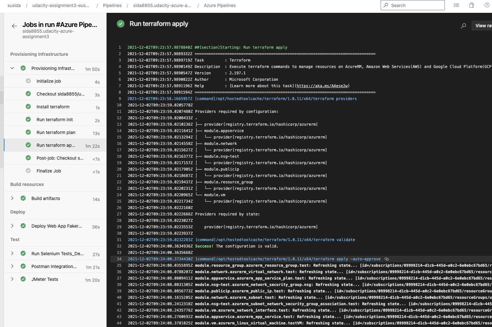

* Execution of pipeline:
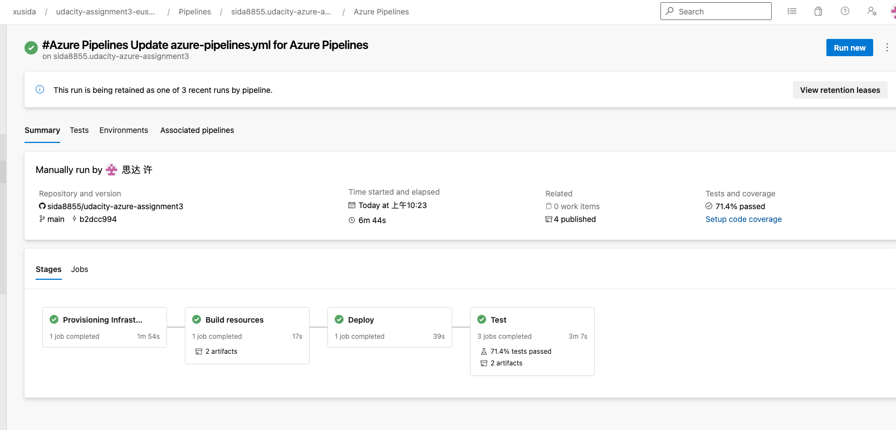

* Postman results:

Summary page:
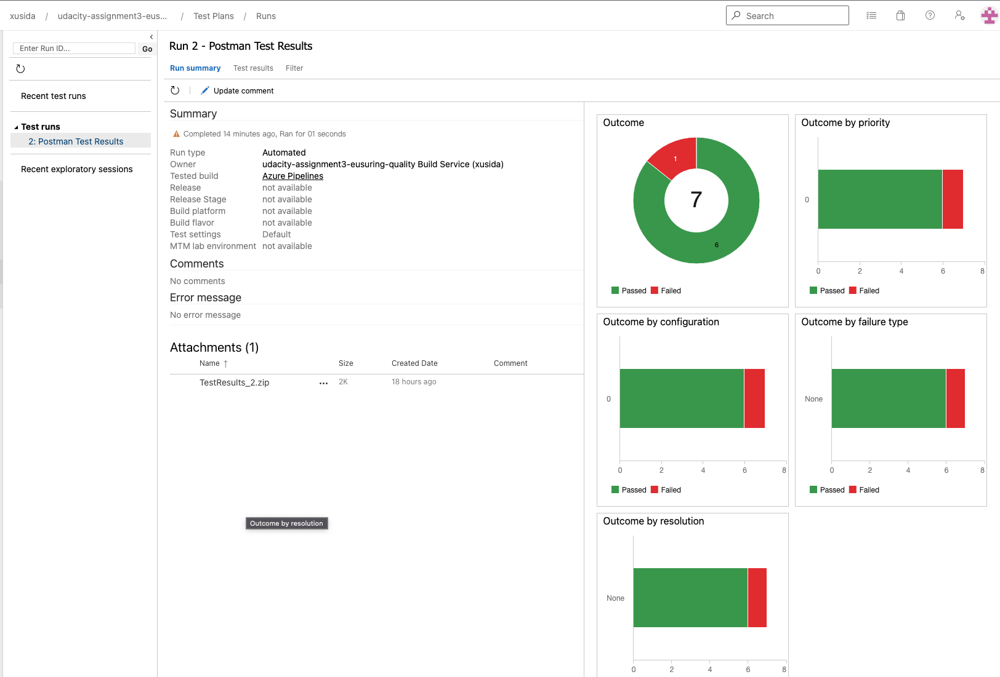

Test result page:
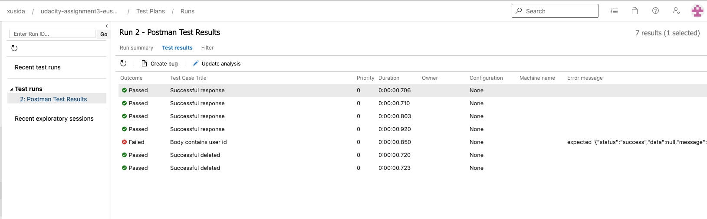

Publish Test result:
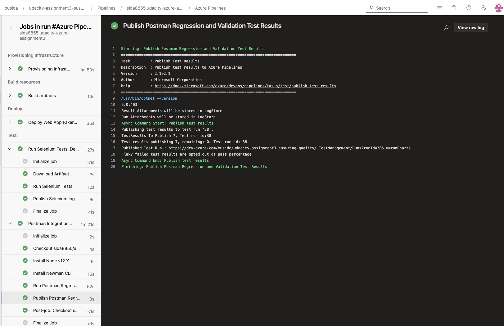

* Selenium result:
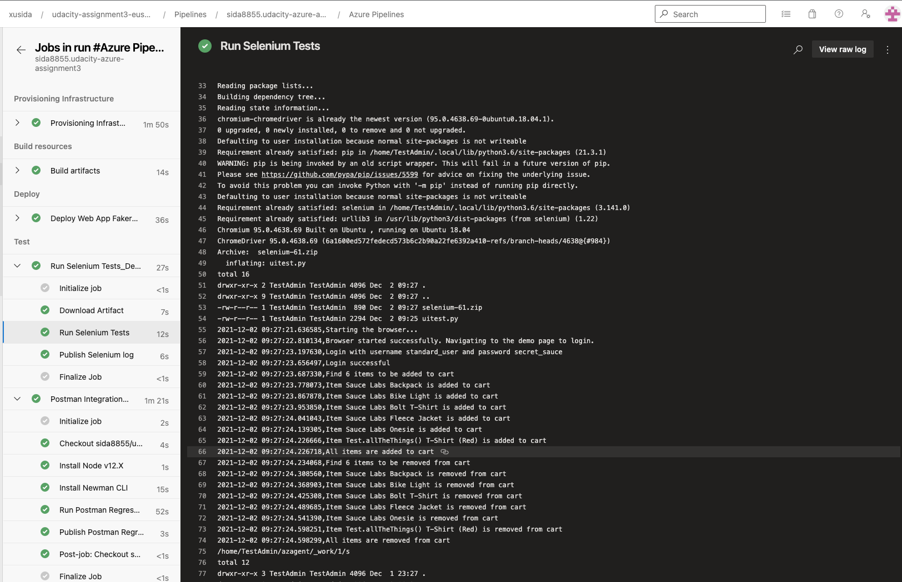

* JMeter result:

JMeter Endurance test:
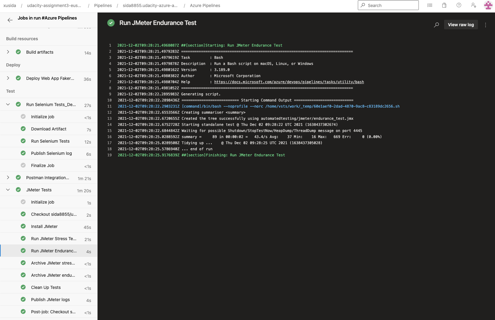

JMeter Stress test:


* Alert result:

Received Email:
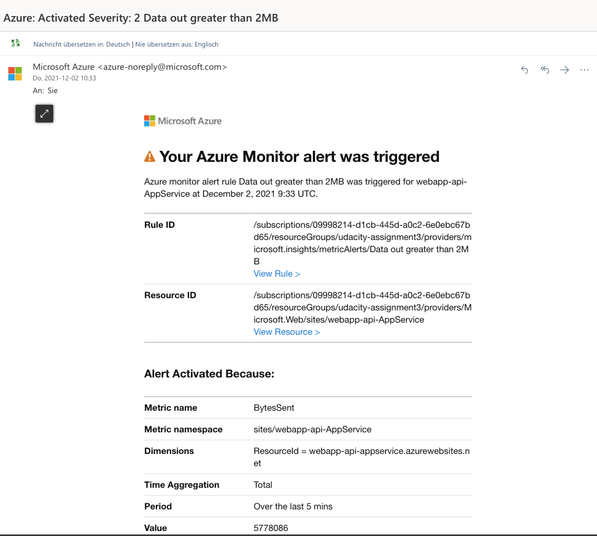

Resource graph when alert is triggered:
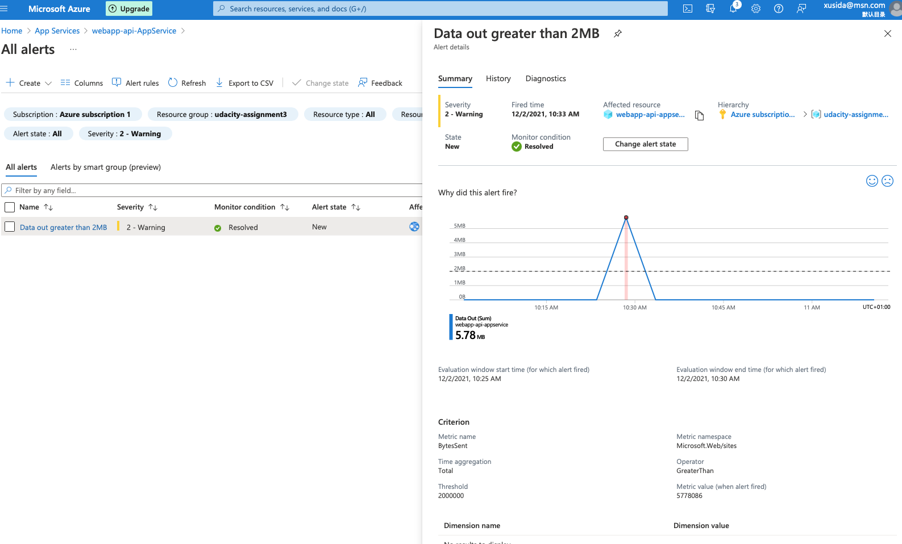

Alert rule:
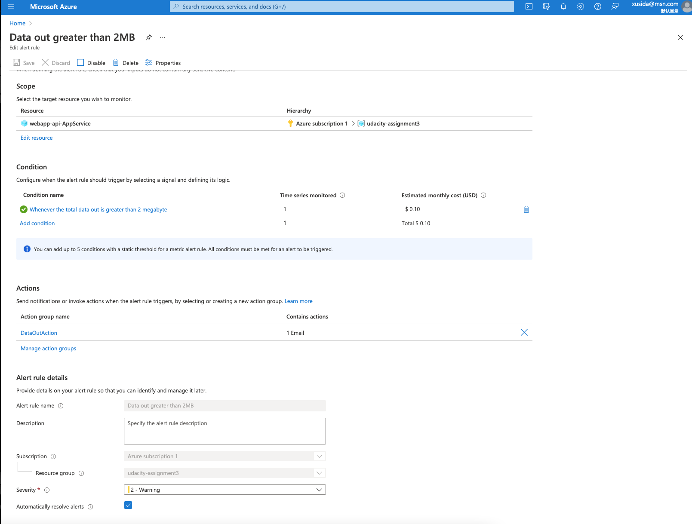

Resource metrics:
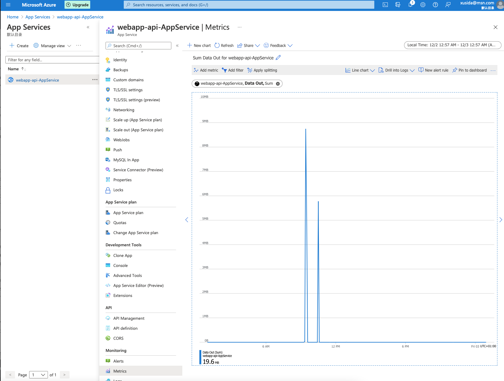

* Custom log

TODO
